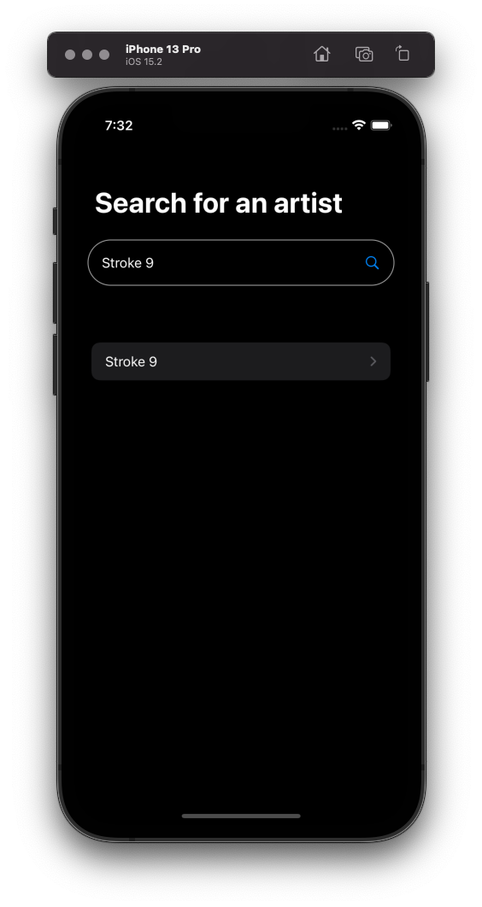
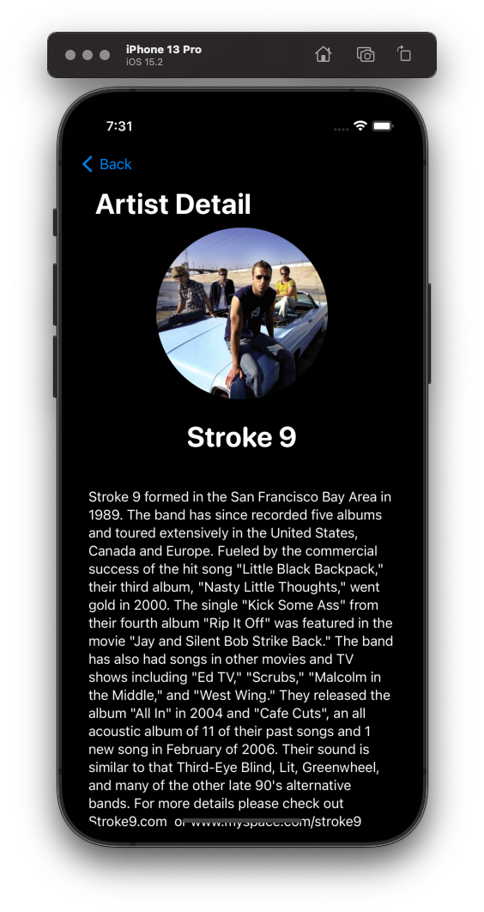

# AudioDBExplorer

## Purpose

I built this sample app for a couple of reasons.

1. To get a little more practice with SwiftUI
1. To check out an interesting API
1. Nothing better to do 😄

## Setup

There's no trick here, just run it in the simulator, search for a band and tap the artist name in the results list. You do need a version of Xcode that's compatible with iOS 15.2.

I limited myself to an hour and a half for this project and there's plenty of room for improvement but the basic idea is working.

